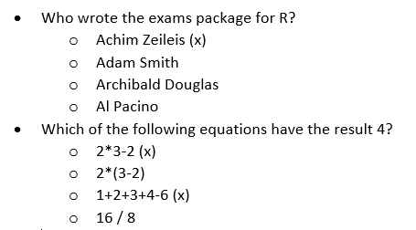

```{r setup, include = FALSE}
library("papaja")
r_refs("r-references.bib")
```

```{r analysis-preferences}
# Seed for random number generation
set.seed(42)
knitr::opts_chunk$set(cache.extra = knitr::rand_seed, eval = FALSE)
```

## Creating exams from a Word template

The `exams` package generates exams from a set of items that are specified with one file per item either as Markdown or as LaTeX. For users unfamiliar with either format, `keira` offers a specification of exams as a Microsoft Word file.

To convert a Word exam to individual item files in LaTeX, use the following function:

```{r}
converter(input_file = "exam.docx", 
          output_directory = "items/")
```



By default, the function converts every item in the Word file to a separate file in the specified output folder (here: "items/"). If there is only a single correct response specified, the item is coded as single response item, otherwise it is coded as multiple response item. This distinction is relevant if partial scoring is used for deriving the points achieved in the item. To override this default behavior, the item body must contain a tag, which can either be "#schoice" to force a single response item or "#mchoice" to force a multiple response item. By default, different responses within an item are randomly shuffled; if multiple variants of the exam are generated, each variant has its own random shuffling of responses. If responses should appear in the exact order as they were given in the original Word file, set the argument `shuffle_items = FALSE`. Furthermore, tags can be used to encode how many points worth each exam is. This is particularly useful if items differ in their point values -- otherwise, fixed number of points per items can be given later when the exam file is generated.

Last, `keira` supports the integration of images. Image files, preferably in the portable network graphics format (PNG) can be integrated by adding the keyword img followed by a colon and the image filename all enclosed in square brackets, e.g. [img:flowers.png].

```{r}
converter(input_file = "exam.docx", 
          output_directory = "items/",
          shuffle_items = FALSE)
```

## Inspecting exams

## Repair

Typically, a few students in every exam miss to fill out the coding matrix for their registration id. If these errors are not caught during the exam, they can be fixed at this stage. Even though the exams package provides a similar functionality already, `keira` has a more comprehensive approach here that also checks for duplicate registration ids (which occasionally occur due to coding errors by the students).

```{r}
keira::registration_repair_tool()
```

The output of this function is a new zip file including all scanned images and the fixed meta information, which can then be used for automated grading and report generation.

## Creating exam

Exam generation is entirely handled by the original function provided by the `exam` package. However, `keira` provides a wrapper function:

```{r}
set.seed(42)
keira::generate(files=list.files("items", full.names=TRUE),
                n=2,
                title="M99 Alpine Therapy Approaches",
                course = "M99",
                showpoints = TRUE,
                intro = intro,
                points = points,
                date="2023-02-15",
                logo = "./logo.png",
                output_dir = "exam"
                )
```

For reproducibility of exams, it seems wise to set a seed for then random number generator (but note potential problems with this approach when upgrading R versions in between (Peikert et al.).

## Generating reports

A major feature of `keira` is the generation of graded report sheets that overlay a layer of correction notes on top of the original exams. This includes information about how many points were achieved in each item, information about which answers were correctly and incorrectly selected, and how many points were achieved in total and what grade was achieved. In part, these pieces of information are also provided natively by the `exams` package, however there is no way to provide reports superimposed on the original exam scans. Figure X shows an exemplary result of the reporting function in `keira`.

```{r echo=FALSE, eval=FALSE}
keira::grade_report(nops_eval_file = "nops_eval.csv",
                    path_to_scans = "png/",
                    outfolder = "reports/")
```

The `grade_report` function has various parameters to adapt the style of the graded report sheet. Table X provides an overview of all parameters.

| Parameter         | Type | Description                                                                                                                 |
|-----------------|-----------------|--------------------------------------|
| show_points       | B    | xx                                                                                                                          |
| show_total_points | B    | xx                                                                                                                          |
|                   |      |                                                                                                                             |
|                   |      |                                                                                                                             |
|                   |      |                                                                                                                             |
|                   |      |                                                                                                                             |
|                   |      |                                                                                                                             |
|                   |      |                                                                                                                             |
|                   |      |                                                                                                                             |
| rotate            | B    | Rotate the exam, such that the marks align with the original sheet. Should always be TRUE but is currently not well tested. |

: B = Boolean, I = Integer, N = Numeric

Item Difficulty

A major advantage of machine-readable exams is the opportunity for a quantitative analysis of the exams. For example, it seems good practice to compute item difficulty both for informing future item selection as well as potentially identifying coding errors or other problems with individual items. To generate an item difficulty plot, use the following command:

```{r echo=FALSE}
keira::plot_item_difficulty()
```

To inspect the distribution of points over all students, use the following command:

```{r}
keira::plot_points_distribution()
```

This command returns a ggplot object, which can be further modified. For example, to add a vertical line that divides the points into passes and fails (assuming that the division is at `totalpoints/2`, use the following code:

```{r}
keira::plot_points_distribution()+
  ggplot2::geom_vline(xintercept = totalpoints/2, lty=2)
```

To get a summary table with item information (including item difficulty and item discrimination), use the following command:

```{r eval=FALSE}
item_summary()
```

## Styling reports

The report style in `keira` is customizable. The parameter `style` is a list of functions that draw marks for hits, misses, false alarms and correct rejections. By default, a hit is drawn with green rectangle, a miss with a red cross, a false alarms with a red box and correct rejections are not marked at all. This default style is called `style_semitransparent`. To create colorblind-friendly report sheets, try the alternative stlye `style_cbfriendly.` Figure show how the report cards look like with each of the two styles.

Helper functions

`keira` provides further helper functions for processing and preparing files in R. The function `pdf2png()` convertes PDF files to PNG files. This function is often useful because scanners may output PDF files whereas the exams package requires PNG files as input. When exam sheets are pinned to the Zeileis (XXX) recommends

## Graphical User Interface

`keira` offers a graphical user-interface for users unfamiliar with R. This interface gives access to basic functionality of the exam generation and evaluation pipelines without the need for programming a single line of code. The interface is realized via the `shiny` package for R. The interface can be run from within R by issuing:

```         
run()
```

The interface is shown in Figure XXX. At the top, there are three tab panels for the different phases of exam creation. The first tab called XXX offers the functionality to generate an exam from a Word file.

## Trouble shooting

-   Problem: Stains or misprints lead to false positives or false negatives. Solution: The exams package provides the optical recognition algorithm, which can be fine-tuned by parameters.

## Data analysis

We used `r cite_r("r-references.bib")` for all our analyses.

\newpage

# References

::: {#refs custom-style="Bibliography"}
:::
